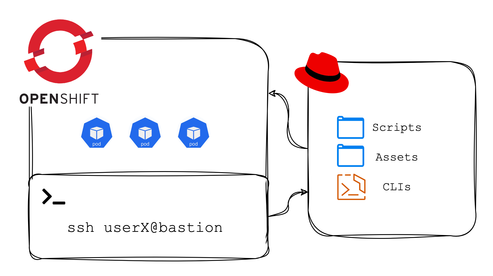
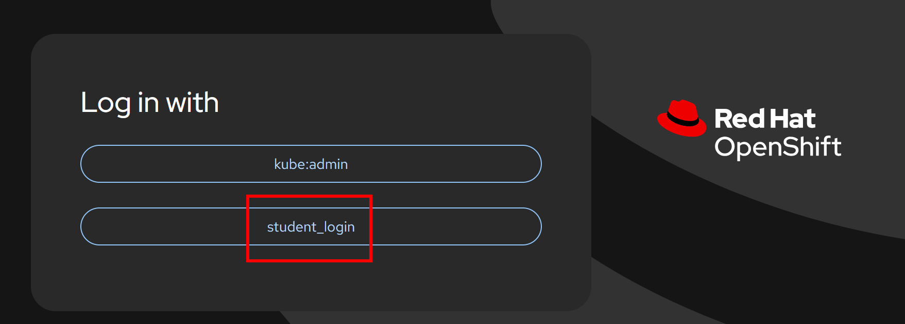
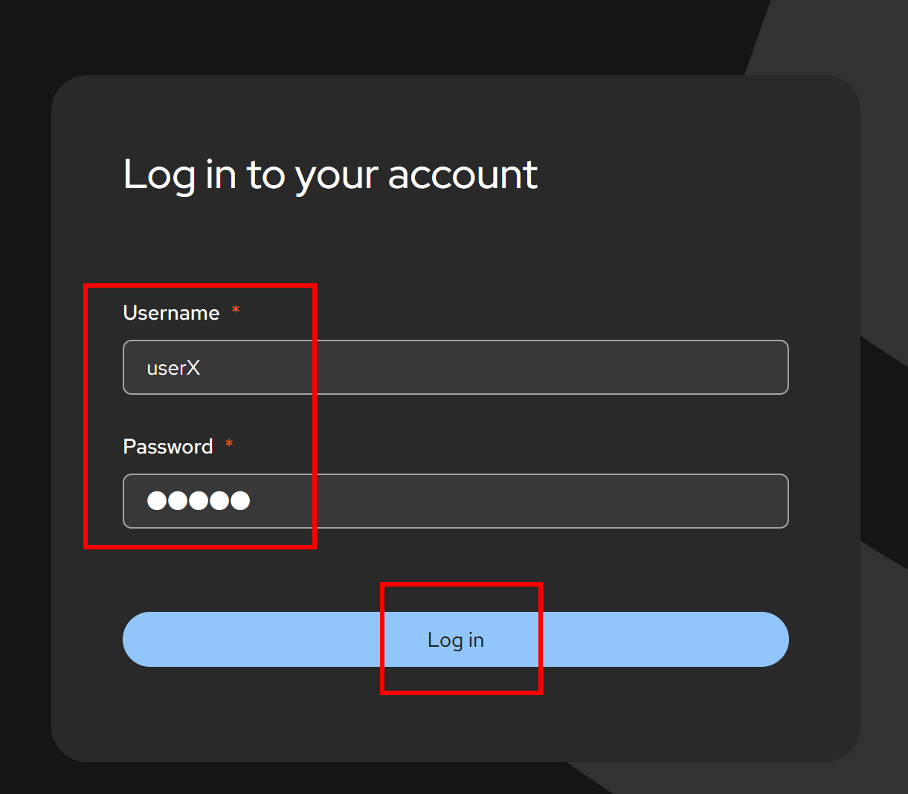
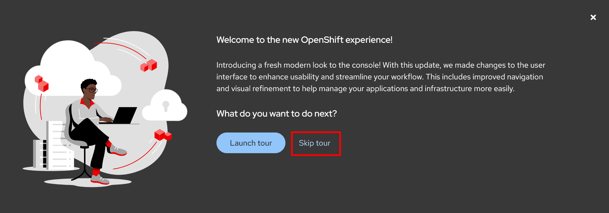
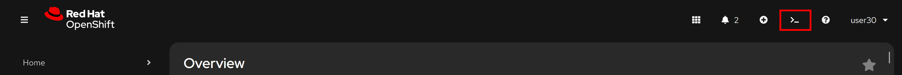
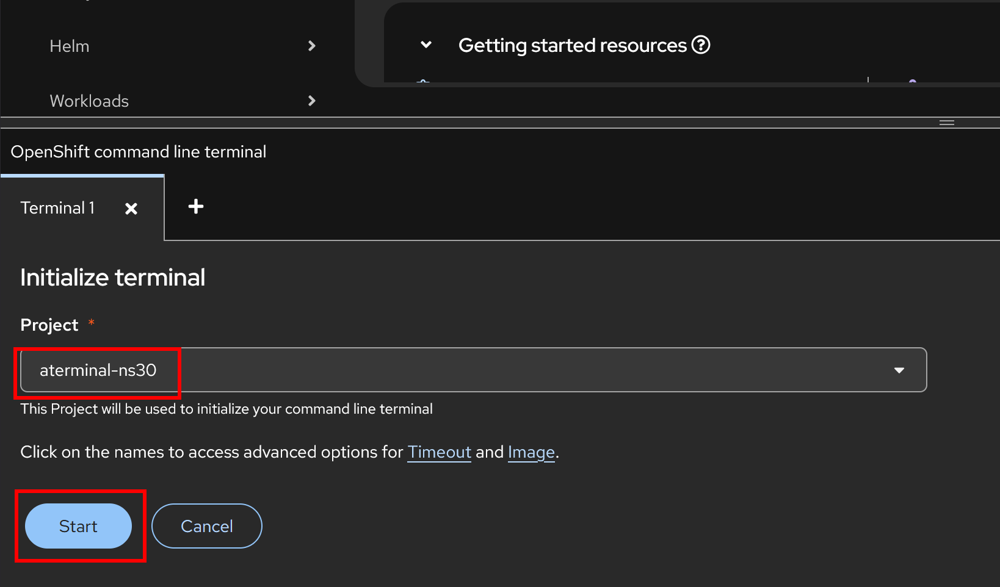
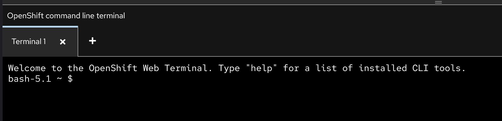
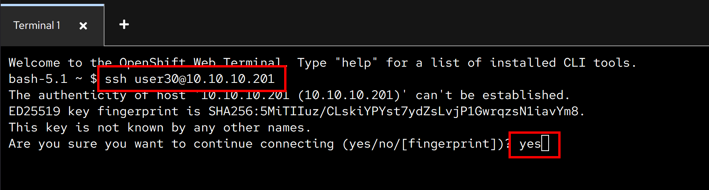
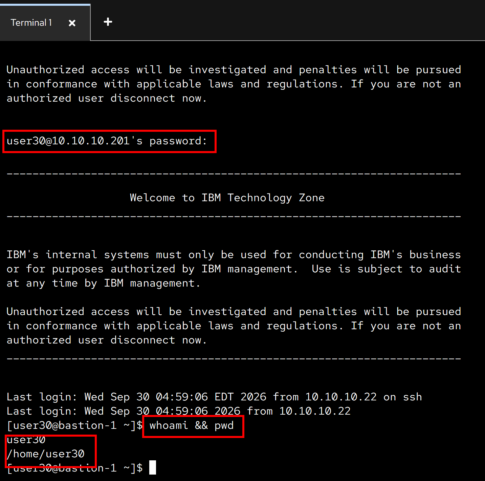

{: style="max-height:200px"}

# Red Hat OpenShift - Container Introduction Exercise

!!! danger "Disclaimer"
    This material has been created for training and learning purposes. It is not, by any means, official documentation supported by either IBM or Red Hat. 

{: style="max-height:600px"}

!!! example "Workshop environment" 
    The environment for this workshop is composed of:
    
    * **OpenShift cluster**
    * **RHEL bastion**
    
    Both are **shared amongst all participants**. Your username and password for both will be provided by your IBM instructor.

## Lab - Container Management Fundamentals with Podman

In this lab, you will learn and practice fundamental container lifecycle operations using **Podman** on the shared RHEL bastion node. You will connect to the bastion via the OpenShift Web Terminal, pull a publicly accessible container image, run and inspect the container, interact with its shell, inspect logs, and properly clean up the container and image.

### 1. Connect to the bastion node from the OCP Web Terminal

First, open the OpenShift Web Console at https://console-openshift-console.apps.itz-740vms.infra01-lb.lon04.techzone.ibm.com. Select **student_login**:

{: style="max-height:200px"}

Login with your user credentials as provided by your instructor:

{: style="max-height:200px"}

Click **Skip tour**:

{: style="max-height:200px"}

Then, open the OpenShift Web Terminal from the top navigation bar:

{: style="max-height:200px"}

Select your terminal Project `aterminal-nsX`, where **X** is your user number. Then click Start:

{: style="max-height:350px"}

After the initialization is complete, you will be shown a web terminal. You will use it to connect to the bastion node where the Podman exercise will be run:

{: style="max-height:220px"}

From the web terminal prompt, connect via SSH to the RHEL bastion node using your student username (`userX` where **X** is your user number), and the password provided by the instructor:

```{ .text .copy title="Command" }
ssh userX@10.10.10.201
```

Enter `yes` when prompted about the server's key:

```{ .text .copy title="Command" }
yes
```

{: style="max-height:220px"}


Enter your password when prompted. Once connected, confirm you are in your home directory on the bastion node:

```{ .text .copy title="Command" }
whoami && pwd
```

```{ .text .no-copy .output title="Output" }
userX
/home/userX
```

{: style="max-height:440px"}

### 2. Pull a container image using podman

We will pull a lightweight, publicly accessible sample application image from Docker Hub. In this case, we use the official Apache HTTP Server image (`docker.io/library/httpd:2.4-alpine`):

```{ .text .copy title="Command" }
podman pull docker.io/library/httpd:2.4-alpine
```

```{ .text .no-copy .output title="Output" }
Trying to pull docker.io/library/httpd:2.4-alpine...
Getting image source signatures
Copying blob e2de96513ba9 done   | 
Copying blob 6c7e7d1981af done   | 
Copying blob 36661b309997 done   | 
Copying blob ddb55e31b4d3 done   | 
Copying blob 4f4fb700ef54 done   | 
Copying blob 8210c35d0f11 done   | 
Copying blob e2e5f9b3fd79 done   | 
Copying config 71cc3b294a done   | 
Writing manifest to image destination
71cc3b294a7d5cab671380adce59be59f7f45683feafc524b5f017f2b7fa0376
```

### 3. Make sure the image has been successfully pulled

Verify that the image is now present in the local container storage on the bastion node:

```{ .text .copy title="Command" }
podman images
```

```{ .text .no-copy .output title="Output" }
REPOSITORY               TAG         IMAGE ID      CREATED      SIZE
docker.io/library/httpd  2.4-alpine  71cc3b294a7d  12 days ago  69.4 MB
```

### 4. Start a container with that image in the background

Start a new container in detached mode (`-d`) named `sample-web-app`, exposing port `8080` on the bastion host mapped to port `80` inside the container:

```{ .text .copy title="Command" }
podman run -d --name sample-web-app -p 8080:80 docker.io/library/httpd:2.4-alpine
```

```{ .text .no-copy .output title="Output" }
b74994ff44fa7784888d519c9cd7e86da0306726555abd44bb839f170d84ebdc
```

### 5. Make sure the container is running using podman

Check the list of running containers to confirm `sample-web-app` is active and listening on port `8080`:

```{ .text .copy title="Command" }
podman ps
```

```{ .text .no-copy .output title="Output" }
CONTAINER ID  IMAGE                               COMMAND           CREATED         STATUS         PORTS                 NAMES
b74994ff44fa  docker.io/library/httpd:2.4-alpine  httpd-foreground  31 seconds ago  Up 31 seconds  0.0.0.0:8080->80/tcp  sample-web-app
```

### 6. Login into the container and verify you are inside

Access an interactive shell (`sh`) inside the running container using `podman exec`:

```{ .text .copy title="Command" }
podman exec -it sample-web-app sh
```

Once inside the container shell prompt, execute a command to inspect the container operating system and verify you are operating inside the container environment:

```{ .text .copy title="Command" }
cat /etc/os-release
```

```{ .text .no-copy .output title="Output" }
NAME="Alpine Linux"
ID=alpine
VERSION_ID=3.24.2
PRETTY_NAME="Alpine Linux v3.24"
HOME_URL="https://alpinelinux.org/"
BUG_REPORT_URL="https://gitlab.alpinelinux.org/alpine/aports/-/issues"
```

Type `exit` to leave the container shell and return to the bastion prompt:

```{ .text .copy title="Command" }
exit
```

### 7. Check the logs of the container

Inspect the output logs produced by the sample application running inside the container:

```{ .text .copy title="Command" }
podman logs sample-web-app
```

```{ .text .no-copy .output title="Output" }
AH00558: httpd: Could not reliably determine the server's fully qualified domain name, using 10.0.2.2. Set the 'ServerName' directive globally to suppress this message
AH00558: httpd: Could not reliably determine the server's fully qualified domain name, using 10.0.2.2. Set the 'ServerName' directive globally to suppress this message
[Wed Sep 30 09:08:25.446397 2026] [mpm_event:notice] [pid 1:tid 1] AH00489: Apache/2.4.68 (Unix) configured -- resuming normal operations
[Wed Sep 30 09:08:25.446577 2026] [core:notice] [pid 1:tid 1] AH00094: Command line: 'httpd -D FOREGROUND'
```

### 8. Stop the container

Stop the running container:

```{ .text .copy title="Command" }
podman stop sample-web-app
```

```{ .text .no-copy .output title="Output" }
sample-web-app
```

### 9. Confirm the container has stopped

Verify that the container is no longer active. Running `podman ps` should not list it, while `podman ps -a` shows the container with an `Exited` status:

```{ .text .copy title="Command" }
podman ps -a --filter name=sample-web-app
```

```{ .text .no-copy .output title="Output" }
CONTAINER ID  IMAGE                               COMMAND           CREATED             STATUS                    PORTS                 NAMES
b74994ff44fa  docker.io/library/httpd:2.4-alpine  httpd-foreground  About a minute ago  Exited (0) 7 seconds ago  0.0.0.0:8080->80/tcp  sample-web-app
```

### 10. Remove the container, and confirm it was removed

Remove the stopped container:

```{ .text .copy title="Command" }
podman rm sample-web-app
```

```{ .text .no-copy .output title="Output" }
sample-web-app
```

Confirm that the container has been completely removed:

```{ .text .copy title="Command" }
podman ps -a --filter name=sample-web-app
```

```{ .text .no-copy .output title="Output" }
CONTAINER ID  IMAGE   COMMAND  CREATED  STATUS  PORTS   NAMES
```

### 11. Remove the image, and confirm it was removed

Remove the downloaded container image from local storage:

```{ .text .copy title="Command" }
podman rmi docker.io/library/httpd:2.4-alpine
```

```{ .text .no-copy .output title="Output" }
Untagged: docker.io/library/httpd:2.4-alpine
Deleted: 71cc3b294a7d5cab671380adce59be59f7f45683feafc524b5f017f2b7fa0376
```

Confirm that the image is no longer present in local storage:

```{ .text .copy title="Command" }
podman images docker.io/library/httpd:2.4-alpine
```

```{ .text .no-copy .output title="Output" }
REPOSITORY  TAG  IMAGE ID  CREATED  SIZE
```

Finally, exit the Bastion node:
```{ .text .copy title="Command" }
exit
```

---

!!! success "Congratulations!"
    You have completed the container management fundamentals exercise with Podman on the bastion node.
